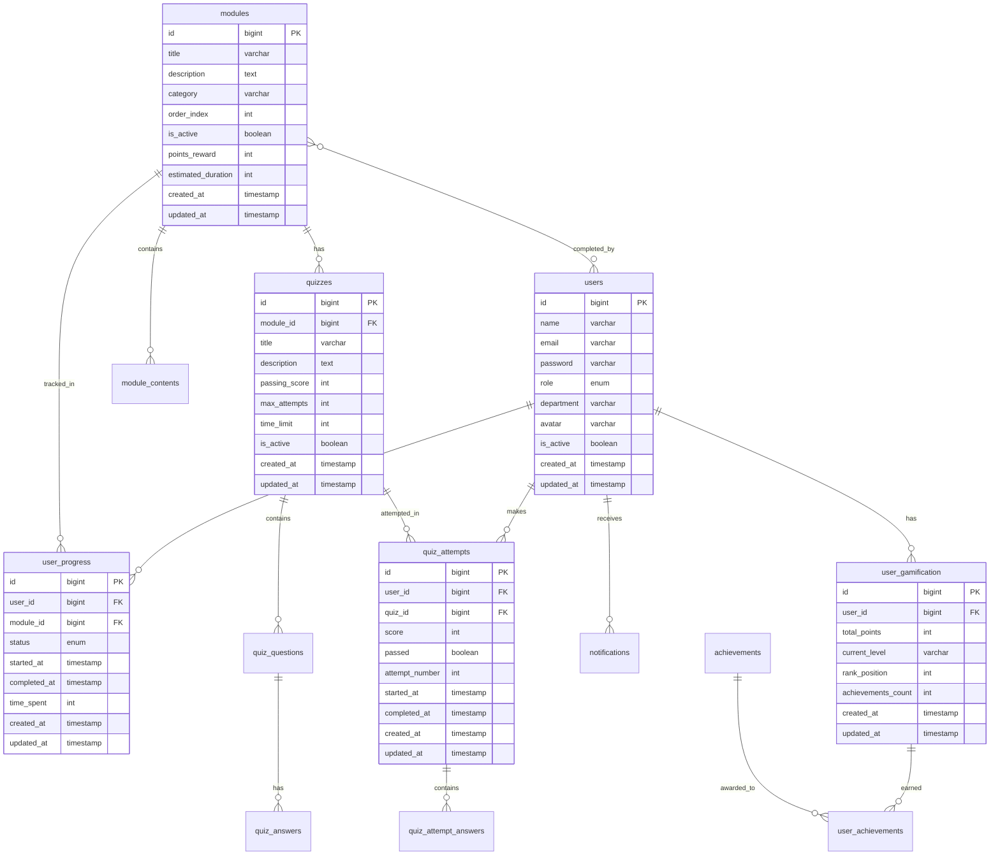

# Documento de Design - Sistema de Onboarding Interativo HCP

## Visão Geral

O Sistema de Onboarding Interativo da HCP será desenvolvido como uma aplicação web moderna utilizando Laravel como backend e uma interface responsiva. O sistema seguirá uma arquitetura MVC com separação clara de responsabilidades, implementando padrões de design que garantem escalabilidade, manutenibilidade e performance.

## Arquitetura

### Arquitetura Geral
```
┌─────────────────┐    ┌─────────────────┐    ┌─────────────────┐
│   Frontend      │    │    Backend      │    │    Database     │
│   (Blade/Vue)   │◄──►│   (Laravel)     │◄──►│    (MySQL)      │
└─────────────────┘    └─────────────────┘    └─────────────────┘
         │                       │                       │
         │              ┌─────────────────┐              │
         └──────────────►│  File Storage   │◄─────────────┘
                        │   (Local/S3)    │
                        └─────────────────┘
```

### Camadas da Aplicação

**1. Camada de Apresentação**
- Blade Templates para renderização server-side
- Vue.js para componentes interativos e feedback visual
- Tailwind CSS para estilização responsiva e modo escuro
- Alpine.js para interações simples e micro-animações
- Framer Motion ou similar para animações avançadas
- Sistema de design corporativo baseado na identidade HCP

**2. Camada de Aplicação**
- Controllers para gerenciar requisições HTTP
- Form Requests para validação
- Resources para transformação de dados
- Middleware para autenticação e autorização

**3. Camada de Domínio**
- Models Eloquent para entidades de negócio
- Services para lógica de negócio complexa
- Repositories para abstração de acesso a dados
- Events e Listeners para desacoplamento

**4. Camada de Infraestrutura**
- Migrations para estrutura do banco
- Seeders para dados iniciais
- Jobs para processamento assíncrono
- Storage para gerenciamento de arquivos

## Componentes e Interfaces

### 1. Sistema de Autenticação

**AuthController**
```php
class AuthController extends Controller
{
    public function showLogin()
    public function login(LoginRequest $request)
    public function logout()
    public function showForgotPassword()
    public function sendResetLink(ForgotPasswordRequest $request)
    public function showResetPassword($token)
    public function resetPassword(ResetPasswordRequest $request)
}
```

**Middleware de Autenticação**
- `auth`: Verificação de usuário logado
- `role`: Verificação de permissões por papel
- `2fa`: Autenticação de dois fatores (opcional)

### 2. Gestão de Usuários

**User Model (Estendido)**
```php
class User extends Authenticatable
{
    // Relacionamentos
    public function progress(): HasMany
    public function gamification(): HasOne
    public function completedModules(): BelongsToMany
    public function quizAttempts(): HasMany
    
    // Métodos de negócio
    public function getProgressPercentage(): int
    public function getCurrentLevel(): string
    public function getTotalPoints(): int
    public function getNextRecommendedModule(): ?Module
}
```

### 3. Sistema de Módulos

**Module Model**
```php
class Module extends Model
{
    // Relacionamentos
    public function contents(): HasMany
    public function quizzes(): HasMany
    public function userProgress(): HasMany
    public function prerequisites(): BelongsToMany
    
    // Métodos de negócio
    public function isAccessibleBy(User $user): bool
    public function getCompletionRate(): float
    public function getAverageTime(): int
}
```

**ModuleController**
```php
class ModuleController extends Controller
{
    public function index()
    public function show(Module $module)
    public function markAsCompleted(Module $module)
    public function getProgress(Module $module)
}
```

### 4. Sistema de Gamificação

**Gamification Model**
```php
class Gamification extends Model
{
    // Relacionamentos
    public function user(): BelongsTo
    public function achievements(): BelongsToMany
    
    // Métodos de negócio
    public function addPoints(int $points, string $reason): void
    public function checkForNewAchievements(): Collection
    public function getCurrentRank(): int
    public function getNextLevelRequirement(): int
}
```

**GamificationService**
```php
class GamificationService
{
    public function awardPoints(User $user, int $points, string $reason): void
    public function checkAchievements(User $user): Collection
    public function updateRanking(): void
    public function getLeaderboard(int $limit = 10): Collection
}
```

### 5. Sistema de Quizzes

**Quiz Model**
```php
class Quiz extends Model
{
    // Relacionamentos
    public function module(): BelongsTo
    public function questions(): HasMany
    public function attempts(): HasMany
    
    // Métodos de negócio
    public function getPassingScore(): int
    public function getMaxAttempts(): int
    public function isPassedBy(User $user): bool
}
```

**QuizController**
```php
class QuizController extends Controller
{
    public function show(Quiz $quiz)
    public function submit(Quiz $quiz, QuizSubmissionRequest $request)
    public function getResults(QuizAttempt $attempt)
    public function retry(Quiz $quiz)
}
```

### 6. Painel Administrativo

**AdminController**
```php
class AdminController extends Controller
{
    public function dashboard()
    public function users()
    public function modules()
    public function reports()
    public function settings()
}
```

**ReportService**
```php
class ReportService
{
    public function getUserProgressReport(): Collection
    public function getModuleStatistics(): Collection
    public function getCompletionRates(): array
    public function exportToExcel(string $type): string
    public function exportToPdf(string $type): string
}
```

## Modelos de Dados

### Estrutura Principal do Banco de Dados



### Relacionamentos Principais

**User → UserProgress (1:N)**
- Um usuário pode ter progresso em múltiplos módulos

**Module → ModuleContent (1:N)**
- Um módulo pode ter múltiplos conteúdos (texto, vídeo, áudio, PDF)

**Quiz → QuizQuestion (1:N)**
- Um quiz pode ter múltiplas questões

**User → QuizAttempt (1:N)**
- Um usuário pode fazer múltiplas tentativas de quizzes

## Tratamento de Erros

### Estratégia de Tratamento de Erros

**1. Validação de Entrada**
```php
class ModuleRequest extends FormRequest
{
    public function rules(): array
    {
        return [
            'title' => 'required|string|max:255',
            'description' => 'required|string',
            'category' => 'required|string|in:orientation,policies,culture',
            'content_type' => 'required|string|in:text,video,audio,pdf',
        ];
    }
    
    public function messages(): array
    {
        return [
            'title.required' => 'O título do módulo é obrigatório.',
            'category.in' => 'Categoria inválida selecionada.',
        ];
    }
}
```

**2. Exception Handling**
```php
class Handler extends ExceptionHandler
{
    public function render($request, Throwable $exception)
    {
        if ($exception instanceof ModelNotFoundException) {
            return response()->json(['error' => 'Recurso não encontrado'], 404);
        }
        
        if ($exception instanceof ValidationException) {
            return response()->json(['errors' => $exception->errors()], 422);
        }
        
        return parent::render($request, $exception);
    }
}
```

**3. Logging Estruturado**
```php
Log::channel('onboarding')->info('Module completed', [
    'user_id' => $user->id,
    'module_id' => $module->id,
    'completion_time' => $completionTime,
    'points_awarded' => $pointsAwarded
]);
```

## Estratégia de Testes

### Tipos de Testes

**1. Testes Unitários**
- Models e suas relações
- Services e lógica de negócio
- Helpers e utilities

**2. Testes de Feature**
- Controllers e rotas
- Middleware de autenticação
- Integração entre componentes

**3. Testes de Browser**
- Fluxos completos de usuário
- Interações JavaScript
- Responsividade

### Estrutura de Testes

```php
class ModuleTest extends TestCase
{
    use RefreshDatabase;
    
    public function test_user_can_complete_module()
    {
        $user = User::factory()->create();
        $module = Module::factory()->create();
        
        $this->actingAs($user)
             ->post("/modules/{$module->id}/complete")
             ->assertStatus(200);
             
        $this->assertDatabaseHas('user_progress', [
            'user_id' => $user->id,
            'module_id' => $module->id,
            'status' => 'completed'
        ]);
    }
    
    public function test_points_are_awarded_on_module_completion()
    {
        $user = User::factory()->create();
        $module = Module::factory()->create(['points_reward' => 50]);
        
        $this->actingAs($user)
             ->post("/modules/{$module->id}/complete");
             
        $this->assertEquals(50, $user->gamification->total_points);
    }
}
```

### Cobertura de Testes

**Metas de Cobertura:**
- Models: 90%+
- Controllers: 85%+
- Services: 95%+
- Overall: 85%+

## Considerações de Performance

### Otimizações de Banco de Dados

**1. Índices Estratégicos**
```sql
-- Índices para consultas frequentes
CREATE INDEX idx_user_progress_user_module ON user_progress(user_id, module_id);
CREATE INDEX idx_quiz_attempts_user_quiz ON quiz_attempts(user_id, quiz_id);
CREATE INDEX idx_modules_category_active ON modules(category, is_active);
```

**2. Eager Loading**
```php
// Evitar N+1 queries
$modules = Module::with(['contents', 'quizzes', 'userProgress'])
                 ->where('is_active', true)
                 ->get();
```

**3. Caching**
```php
// Cache de dados frequentemente acessados
$leaderboard = Cache::remember('leaderboard', 3600, function () {
    return User::with('gamification')
               ->orderBy('total_points', 'desc')
               ->limit(10)
               ->get();
});
```

### Otimizações de Frontend

**1. Lazy Loading de Conteúdo**
- Carregamento sob demanda de vídeos e imagens
- Paginação de módulos e quizzes

**2. Compressão de Assets**
- Minificação de CSS e JavaScript
- Compressão de imagens

**3. CDN para Assets Estáticos**
- Servir arquivos de mídia via CDN
- Cache de longa duração para recursos estáticos

## Segurança

### Medidas de Segurança Implementadas

**1. Autenticação e Autorização**
- Hash seguro de senhas (bcrypt)
- Tokens CSRF em formulários
- Rate limiting para login
- Middleware de autorização por papel

**2. Validação e Sanitização**
- Validação rigorosa de entrada
- Sanitização de dados HTML
- Proteção contra SQL Injection via Eloquent

**3. Proteção de Arquivos**
- Upload seguro com validação de tipo
- Armazenamento fora do webroot
- Verificação de vírus (opcional)

**4. Logs de Auditoria**
- Log de ações administrativas
- Rastreamento de progresso do usuário
- Monitoramento de tentativas de login

## Responsividade e Acessibilidade

### Design Mobile-First e Responsivo

**Abordagem Mobile-First:**
- Design primário otimizado para dispositivos móveis
- Progressive enhancement para telas maiores
- Touch-first interactions em todos os componentes
- Navegação por gestos e swipe

**Breakpoints Responsivos:**
- Mobile: 320px - 767px (design base)
- Tablet: 768px - 1024px
- Desktop: 1025px - 1440px
- Large Desktop: > 1440px
- Smart TV: > 1920px

**Componentes Mobile-First:**
- Bottom navigation para mobile
- Swipe gestures para navegação entre módulos
- Pull-to-refresh em listas
- Cards otimizados para thumb navigation
- Formulários com teclado virtual otimizado
- Player de vídeo com controles touch-friendly

### Design Corporativo e Identidade Visual HCP

**Sistema de Design Baseado na Identidade HCP:**
- Paleta de cores inspirada na arquitetura corporativa moderna
- Tipografia clean e profissional (Inter, Poppins ou similar)
- Logo HCP integrado de forma elegante
- Elementos visuais que remetem ao ambiente corporativo
- Padrões visuais que refletem inovação e profissionalismo

**Página Inicial Moderna e Intuitiva:**
```css
/* Inspirada na imagem corporativa da HCP */
.hero-section {
  background: linear-gradient(
    135deg, 
    rgba(15, 23, 42, 0.95) 0%, 
    rgba(30, 41, 59, 0.9) 100%
  ), 
  url('/images/hcp-building.jpg');
  background-size: cover;
  background-position: center;
  min-height: 100vh;
  display: flex;
  align-items: center;
  justify-content: center;
}

.welcome-card {
  background: rgba(255, 255, 255, 0.95);
  backdrop-filter: blur(20px);
  border-radius: 24px;
  padding: 3rem;
  max-width: 600px;
  text-align: center;
  box-shadow: 0 25px 50px -12px rgba(0, 0, 0, 0.25);
  border: 1px solid rgba(255, 255, 255, 0.2);
}

/* Modo escuro */
[data-theme="dark"] .welcome-card {
  background: rgba(30, 41, 59, 0.95);
  border: 1px solid rgba(148, 163, 184, 0.2);
  color: white;
}
```

**Elementos da Página Inicial:**
1. **Hero Section com Imagem de Fundo:**
   - Imagem do edifício corporativo da HCP (similar à fornecida)
   - Overlay escuro sutil para melhor legibilidade
   - Efeito parallax sutil no scroll

2. **Card Central Glassmorphism:**
   - Fundo translúcido com blur effect
   - Bordas arredondadas modernas
   - Sombra suave e elegante

3. **Conteúdo Hierárquico:**
   - Logo HCP no topo
   - Título principal: "Welcome to Hemera Capital Partners"
   - Subtítulo explicativo sobre o sistema
   - Call-to-action: "Your journey to success starts here"
   - Botões de ação estilizados

4. **Micro-animações:**
   - Fade-in suave dos elementos
   - Hover effects nos botões
   - Transições fluidas entre estados

**Modo Escuro (Dark Mode):**
```css
/* Paleta de cores para modo escuro */
:root[data-theme="dark"] {
  --primary-bg: #0f0f0f;
  --secondary-bg: #1a1a1a;
  --card-bg: #2a2a2a;
  --text-primary: #ffffff;
  --text-secondary: #b3b3b3;
  --accent-color: #3b82f6;
  --success-color: #10b981;
  --warning-color: #f59e0b;
  --error-color: #ef4444;
}

/* Paleta de cores para modo claro */
:root[data-theme="light"] {
  --primary-bg: #ffffff;
  --secondary-bg: #f8fafc;
  --card-bg: #ffffff;
  --text-primary: #1f2937;
  --text-secondary: #6b7280;
  --accent-color: #3b82f6;
  --success-color: #10b981;
  --warning-color: #f59e0b;
  --error-color: #ef4444;
}
```

**Toggle de Tema:**
- Botão de alternância entre modo claro/escuro
- Persistência da preferência do usuário
- Transições suaves entre temas
- Detecção automática da preferência do sistema

### Interações Visuais e Feedback

**Micro-interações:**
- Hover effects em botões e cards
- Loading states com skeleton screens
- Animações de transição entre páginas
- Feedback visual para ações do usuário
- Progress indicators animados

**Feedback Visual Avançado:**
```javascript
// Exemplo de feedback visual para ações
const showFeedback = (type, message) => {
  // Toast notifications com animações
  toast.show({
    type: type, // success, error, warning, info
    message: message,
    duration: 3000,
    animation: 'slide-in-top'
  });
  
  // Haptic feedback para mobile
  if (navigator.vibrate) {
    navigator.vibrate(type === 'success' ? [100] : [100, 50, 100]);
  }
};
```

**Animações e Transições:**
- Page transitions com fade/slide effects
- Card flip animations para quiz results
- Progress bar animations
- Confetti effects para conquistas
- Pulse animations para notificações
- Smooth scrolling e parallax effects

**Estados Visuais:**
- Loading states com spinners personalizados
- Empty states com ilustrações
- Error states com ações de recuperação
- Success states com celebrações visuais
- Skeleton loading para conteúdo

**Componentes Interativos:**
```vue
<!-- Exemplo de card interativo -->
<template>
  <div class="module-card" 
       :class="{ 'completed': isCompleted, 'locked': isLocked }"
       @click="handleCardClick"
       @mouseenter="showPreview"
       @mouseleave="hidePreview">
    
    <!-- Progress ring animation -->
    <div class="progress-ring">
      <svg class="progress-circle">
        <circle :stroke-dasharray="circumference" 
                :stroke-dashoffset="progressOffset"
                class="progress-bar"/>
      </svg>
    </div>
    
    <!-- Content with fade-in animation -->
    <transition name="fade">
      <div v-if="showContent" class="card-content">
        <h3 class="card-title">{{ module.title }}</h3>
        <p class="card-description">{{ module.description }}</p>
      </div>
    </transition>
    
    <!-- Interactive elements -->
    <div class="card-actions">
      <button @click="startModule" 
              class="btn-primary"
              :disabled="isLocked">
        {{ buttonText }}
      </button>
    </div>
  </div>
</template>
```

**Gamificação Visual:**
- Animações de pontuação (números flutuantes)
- Efeitos de partículas para conquistas
- Barras de progresso animadas
- Medalhas com brilho e rotação
- Ranking com transições suaves
- Avatar customization com preview

### Acessibilidade

**Padrões WCAG 2.1:**
- Contraste adequado de cores (4.5:1 mínimo)
- Navegação por teclado completa
- Textos alternativos para imagens e ícones
- Estrutura semântica HTML5
- Suporte a leitores de tela (ARIA labels)
- Focus indicators visíveis
- Redução de movimento para usuários sensíveis

## Integração e APIs

### APIs Internas

**REST API para Mobile (futuro)**
```php
Route::prefix('api/v1')->group(function () {
    Route::get('/modules', [ModuleApiController::class, 'index']);
    Route::get('/progress', [ProgressApiController::class, 'show']);
    Route::post('/quiz/{quiz}/submit', [QuizApiController::class, 'submit']);
});
```

### Integrações Externas

**1. Sistema de E-mail**
- Notificações de progresso
- Lembretes automáticos
- Recuperação de senha

**2. Active Directory (Opcional)**
- Single Sign-On (SSO)
- Sincronização de usuários

**3. Zoom/Teams (Opcional)**
- Sessões ao vivo integradas
- Gravações automáticas

## Monitoramento e Analytics

### Métricas de Negócio

**1. Engajamento**
- Taxa de conclusão de módulos
- Tempo médio por módulo
- Frequência de acesso

**2. Performance**
- Taxa de aprovação em quizzes
- Progressão por departamento
- Identificação de gargalos

**3. Sistema**
- Tempo de resposta das páginas
- Erros de aplicação
- Uso de recursos do servidor

### Dashboards

**Dashboard Executivo:**
- KPIs de onboarding
- Comparativos por período
- Alertas de performance

**Dashboard Operacional:**
- Status do sistema
- Logs de erro
- Métricas de uso